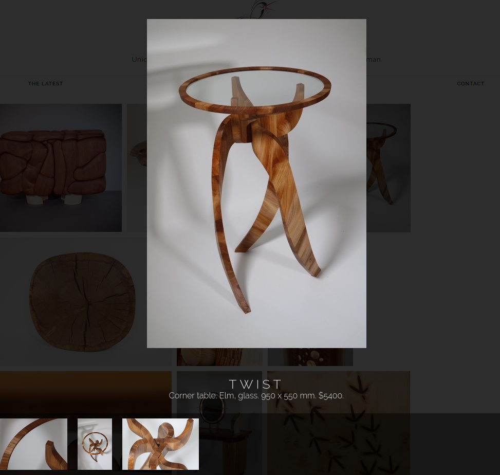

# Special Gallery Plugin




## Overview
A simple yet powerful gallery plugin for WordPress. It allows you to manage multiple image galleries and seamlessly integrate them into your website. Each gallery presents items in a grid layout, and when clicked, these items expand into a unique slideshow view.

## Features
- Create and manage multiple galleries.
- Responsive grid layout.
- Expandable slideshow for gallery items.
- Easy integration with WordPress.

## Installation Guide

### Requirements
- **WordPress**
- **Elementor Plugin** (for drag-and-drop functionality)

### Installation
1. **Install the Elementor Plugin** if you haven't already.
2. **Clone the repository** from GitHub:
   ```bash
   git clone https://github.com/jontymorris/Special-Gallery.git
   ```
3. **Copy the Plugin**: Move the `special-gallery` folder into your WordPress `wp-content/plugins` directory.
4. **Activate the Plugin**:
   - Go to your WordPress Dashboard.
   - Navigate to **Plugins** and activate the **Special Gallery** plugin.
   
After activation, a new menu option called **Special Gallery** will appear in the WordPress Dashboard.

> **Important:** Do not embed multiple galleries on the same page as this may cause JavaScript issues, preventing galleries from displaying properly.

## Add to page
Navigate to the page you want to add the gallery and add the shortcode link shown in the admin panel.
1. Open with Elementor
2. Create a Shortcode widget
3. Paste in your code, e.g. `[special-gallery id=0]`

## Development Setup

### Prerequisites
Before setting up your development environment, make sure you have the following installed:

- **Docker**

### Setting Up the Development Environment
1. **Start the Development Environment** using Docker Compose:
   ```bash
   docker-compose -f development/docker-compose.yml up
   ```
2. **Access WordPress**:
   - Once the containers are running, open your browser and navigate to: `http://localhost:80`
   - You will need to enable the **Special Gallery** plugin from the WordPress plugins page.

> **Note**: You must activate the plugin in WordPress before you can begin testing and development.
